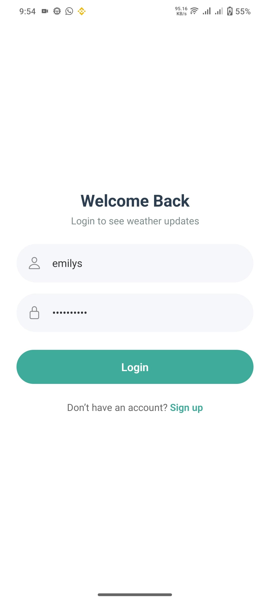
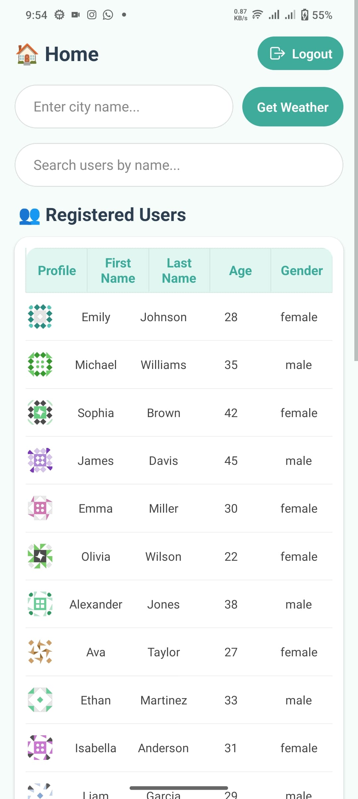
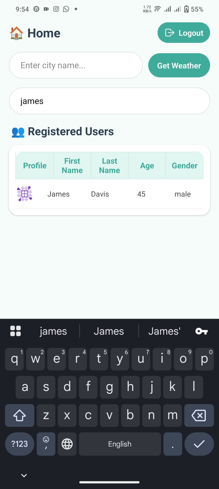

# 🌤 WeatherApp (React Native + Expo)

A modern React Native application built with **Expo**, providing real-time weather updates based on user-entered city names, user authentication, and dynamic data visualization. Designed with a clean, mobile-first UI and integrated with external APIs using Axios.

---

## 📱 Features

- 🔐 **Login & Signup** screens (with validation and API connection)
- 🌍 **Weather by City** – user can enter any city and get live weather data
- 📦 **Axios** for all API interactions (weather + dummy user data)
- 👤 **User List** – fetched from DummyJSON API and displayed in a styled table
- 🔍 **Search** functionality to filter users by name
- 🚪 **Logout** option to navigate back to Login screen
- 🧑‍🎨 Clean, professional UI using theme color `#3DAB9B`
- ⚠️ Friendly error handling (e.g. invalid city alert)

---

## 📸 Screenshots

| Login Screen | Signup Screen |
|--------------|----------------|
|  |  |

| Home Screen | Weather Section |
|-------------|------------------|
|  |  | 

> 📷 Screenshots are stored in `screenshots/` folder.

---

## 🔗 APIs Used

- 🌐 **OpenWeatherMap API**
  - Endpoint: `/weather?q={city}&appid={API_KEY}&units=metric`
  - Use: Get live weather for any city
- 📋 **DummyJSON API**
  - Endpoint: `/users`
  - Use: Fetch and display dummy user data

---

## ⚙️ Tech Stack

- [React Native](https://reactnative.dev/)
- [Expo](https://expo.dev/)
- [Axios](https://axios-http.com/)
- [React Navigation](https://reactnavigation.org/)
- Native components & styling

---

## 🚀 Installation & Setup

```bash
# Clone the repo
git clone https://github.com/HafizBasit7/weather-app.git
cd weather-app

# Install dependencies
npm install

# Start Expo
npx expo start


Contact
GitHub: @HafizBasit7
Email: hafiz.zes7@gmail.com

